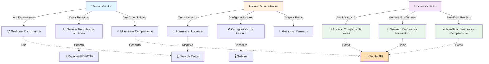

# 📊 Diagramas UML - Solinal

## 1. DIAGRAMA DE CASOS DE USO

Este diagrama muestra las interacciones entre los actores y el sistema Solinal.

---

## 2. CASOS DE USO DETALLADOS

### 📋 **UC1: Gestionar Documentos**
| Elemento | Descripción |
|----------|-------------|
| **Actor Principal** | Usuario Auditor |
| **Precondición** | Usuario autenticado |
| **Flujo Principal** | 1. Ver lista de documentos 2. Crear nuevo documento 3. Editar documento existente 4. Eliminar documento 5. Ver historial de cambios |
| **Postcondición** | Documento guardado en BD |

### 📊 **UC2: Generar Reportes de Auditoría**
| Elemento | Descripción |
|----------|-------------|
| **Actor Principal** | Usuario Auditor |
| **Precondición** | Documentos disponibles en sistema |
| **Flujo Principal** | 1. Seleccionar rango de fechas 2. Elegir criterios de filtro 3. Generar reporte 4. Descargar en PDF/CSV |
| **Postcondición** | Reporte generado y descargado |

### 🤖 **UC7: Analizar Cumplimiento con IA**
| Elemento | Descripción |
|----------|-------------|
| **Actor Principal** | Usuario Analista |
| **Precondición** | Documento cargado, API Claude activa |
| **Flujo Principal** | 1. Seleccionar documento 2. Elegir estándar (ISO 27001, GDPR, etc.) 3. Enviar a análisis IA 4. Recibir análisis con puntuación 5. Ver riesgos y recomendaciones |
| **Postcondición** | Análisis guardado en histórico |
| **Excepciones** | Si API falla → mostrar error |

### 📝 **UC8: Generar Resúmenes Automáticos**
| Elemento | Descripción |
|----------|-------------|
| **Actor Principal** | Usuario Analista |
| **Precondición** | Documento cargado |
| **Flujo Principal** | 1. Seleccionar documento 2. Solicitar resumen con IA 3. Recibir resumen resumido (max 200 palabras) 4. Copiar o descargar resumen |
| **Postcondición** | Resumen disponible en interfaz |

### 🔍 **UC9: Identificar Brechas de Cumplimiento**
| Elemento | Descripción |
|----------|-------------|
| **Actor Principal** | Usuario Analista |
| **Precondición** | Documento + Requisitos definidos |
| **Flujo Principal** | 1. Cargar documento 2. Ingresar requisitos 3. Ejecutar análisis de brechas 4. Recibir lista de brechas 5. Ver nivel de severidad |
| **Postcondición** | Informe de brechas generado |

---

## 3. CASOS DE USO SECUNDARIOS

### 👥 **UC4: Administrar Usuarios**
| Elemento | Descripción |
|----------|-------------|
| **Actor Principal** | Administrador |
| **Casos Incluidos** | Crear usuario, Editar usuario, Eliminar usuario, Resetear contraseña |

### 🔐 **UC6: Gestionar Permisos**
| Elemento | Descripción |
|----------|-------------|
| **Actor Principal** | Administrador |
| **Roles Disponibles** | Auditor, Analista, Administrador |

---

## 4. RESUMEN DE CASOS DE USO

| # | Caso de Uso | Actor | Entidad Principal | Estado |
|---|---|---|---|---|
| 1 | Gestionar Documentos | Auditor | Document | ✅ Implementado |
| 2 | Generar Reportes | Auditor | AuditLog | ✅ En desarrollo |
| 3 | Monitorear Cumplimiento | Auditor | Compliance | ✅ Implementado |
| 4 | Administrar Usuarios | Admin | User | ✅ Implementado |
| 5 | Configurar Sistema | Admin | Config | ✅ Implementado |
| 6 | Gestionar Permisos | Admin | Role | ✅ Implementado |
| 7 | **Analizar Cumplimiento con IA** | Analista | AIAnalysis | ✅ **NUEVO** |
| 8 | **Generar Resúmenes** | Analista | AISummary | ✅ **NUEVO** |
| 9 | **Identificar Brechas** | Analista | AIGaps | ✅ **NUEVO** |

**Total: 9 casos de uso principales**
- **6** casos legados del MVP
- **3** casos NUEVOS de IA (UC7, UC8, UC9)

---
