# 📐 Diagrama de Clases - Solinal

## DIAGRAMA DE CLASES COMPLETO

```mermaid
classDiagram
    %% ============================================================
    %% MODELOS DE DATOS (Backend)
    %% ============================================================
    
    class User {
        -id: UUID
        -email: string
        -password: string
        -nombre: string
        -role: RoleName
        -activo: boolean
        -createdAt: Date
        -updatedAt: Date
        +login(email, password): void
        +logout(): void
        +updateProfile(data): void
    }
    
    class Document {
        -id: UUID
        -code: string
        -title: string
        -type: DocumentType
        -norma: string
        -estado: DocumentStatus
        -version: string
        -content: string
        -createdBy: string
        -createdAt: Date
        -updatedAt: Date
        -vencido: boolean
        -critico: boolean
        +create(data): Document
        +update(data): void
        +delete(): void
        +getHistory(): Revision[]
    }
    
    class DocumentRevision {
        -id: UUID
        -documentId: UUID
        -content: string
        -version: string
        -editedBy: string
        -editedAt: Date
        -cambios: string
        +getChanges(): string
    }
    
    class DocumentTemplate {
        -id: UUID
        -key: string
        -name: string
        -norma: string
        -type: DocumentType
        -content: string
        -createdAt: Date
        +useTemplate(documentId): void
    }
    
    class ComplianceStatus {
        -id: UUID
        -documentId: UUID
        -standard: string
        -score: number
        -estado: string
        -lastChecked: Date
        +updateStatus(score, estado): void
    }
    
    class AuditLog {
        -id: UUID
        -userId: UUID
        -action: string
        -entity: string
        -entityId: UUID
        -details: JSON
        -timestamp: Date
        -ipAddress: string
        +logAction(action, entity, details): void
    }
    
    class Comment {
        -id: UUID
        -documentId: UUID
        -authorId: UUID
        -content: string
        -createdAt: Date
        -updatedAt: Date
        +create(documentId, content): Comment
        +update(content): void
        +delete(): void
    }
    
    class Configuration {
        -id: UUID
        -key: string
        -value: string
        -description: string
        -updatedBy: UUID
        -updatedAt: Date
        +getSetting(key): string
        +updateSetting(key, value): void
    }
    
    %% ============================================================
    %% SERVICIOS DE IA (Backend)
    %% ============================================================
    
    class AIService {
        -anthropicClient: Anthropic
        -model: string
        +analyzeDocumentCompliance(content, standard): Promise~AIAnalysisResult~
        +generateDocumentSummary(content): Promise~AISummaryResult~
        +identifyComplianceGaps(content, requirements): Promise~AIGapsResult~
        -callClaudeAPI(messages): Promise~Response~
    }
    
    class AIAnalysisResult {
        -summary: string
        -risks: string[]
        -recommendations: string[]
        -score: number
    }
    
    class AISummaryResult {
        -summary: string
    }
    
    class AIGapsResult {
        -gaps: string[]
        -severity: 'low' | 'medium' | 'high'
        -recommendations: string[]
    }
    
    class AIAnalysisStorage {
        -id: UUID
        -documentId: UUID
        -standard: string
        -result: AIAnalysisResult
        -createdAt: Date
        +saveAnalysis(documentId, standard, result): void
        +getAnalysisHistory(documentId): AIAnalysisStorage[]
    }
    
    %% ============================================================
    %% ENUMS
    %% ============================================================
    
    class DocumentType {
        <<enumeration>>
        Procedimiento
        Política
        Manual
        Instructivo
        Checklist
    }
    
    class DocumentStatus {
        <<enumeration>>
        Borrador
        EnAprobación
        Aprobado
        Rechazado
    }
    
    class RoleName {
        <<enumeration>>
        Auditor
        Analista
        Administrador
    }
    
    class Severity {
        <<enumeration>>
        Low
        Medium
        High
    }
    
    %% ============================================================
    %% SERVICIOS (Backend)
    %% ============================================================
    
    class AuthService {
        -jwt: any
        +login(email, password): Token
        +logout(): void
        +verifyToken(token): User
        +generateToken(user): string
        +hashPassword(password): string
    }
    
    class DocumentService {
        -db: Database
        +getAllDocuments(): Document[]
        +getDocumentById(id): Document
        +createDocument(data): Document
        +updateDocument(id, data): Document
        +deleteDocument(id): void
        +getDocumentVersions(id): DocumentRevision[]
    }
    
    class ComplianceService {
        -db: Database
        -aiService: AIService
        +getComplianceStatus(): ComplianceStatus[]
        +checkCompliance(documentId, standard): ComplianceStatus
        +getAlerts(): ComplianceAlert[]
        +triggerAnalysis(documentId): void
    }
    
    class AuditService {
        -db: Database
        +logAction(userId, action, entity, details): AuditLog
        +getAuditLogs(filters): AuditLog[]
        +exportAuditReport(format): File
        +getUserActivity(userId): AuditLog[]
    }
    
    class UserService {
        -db: Database
        -authService: AuthService
        +createUser(data): User
        +updateUser(id, data): User
        +deleteUser(id): void
        +getUsersByRole(role): User[]
        +resetPassword(userId): void
    }
    
    %% ============================================================
    %% CONTROLADORES (Backend Routes)
    %% ============================================================
    
    class AIController {
        -aiService: AIService
        -auditService: AuditService
        +analyzeCompliance(req, res): void
        +summarizeDocument(req, res): void
        +identifyGaps(req, res): void
        -validateInput(content, standard): boolean
    }
    
    class DocumentController {
        -documentService: DocumentService
        -auditService: AuditService
        +getDocuments(req, res): void
        +createDocument(req, res): void
        +updateDocument(req, res): void
        +deleteDocument(req, res): void
    }
    
    class ComplianceController {
        -complianceService: ComplianceService
        -aiService: AIService
        +getStatus(req, res): void
        +getAlerts(req, res): void
        +getRequirements(req, res): void
    }
    
    class AuditController {
        -auditService: AuditService
        +getLogs(req, res): void
        +logAction(req, res): void
        +exportReport(req, res): void
    }
    
    class AuthController {
        -authService: AuthService
        -userService: UserService
        +login(req, res): void
        +logout(req, res): void
        +verify(req, res): void
    }
    
    %% ============================================================
    %% FRONTEND - HOOKS
    %% ============================================================
    
    class useAIAnalysis {
        -loading: boolean
        -error: string | null
        -data: AIAnalysisResult | null
        +analyze(content, standard): Promise~void~
    }
    
    class useAISummary {
        -loading: boolean
        -error: string | null
        -data: AISummaryResult | null
        +summarize(content): Promise~void~
    }
    
    class useAIGaps {
        -loading: boolean
        -error: string | null
        -data: AIGapsResult | null
        +identifyGaps(content, requirements): Promise~void~
    }
    
    class useMobile {
        -isMobile: boolean
        +checkBreakpoint(): boolean
    }
    
    %% ============================================================
    %% FRONTEND - SERVICIOS
    %% ============================================================
    
    class apiService {
        -baseURL: string
        +apiCall(endpoint, options): Promise~any~
    }
    
    class aiAPI {
        +analyzeCompliance(content, standard): Promise~AIAnalysisResult~
        +summarize(content): Promise~AISummaryResult~
        +identifyGaps(content, requirements): Promise~AIGapsResult~
    }
    
    class documentsAPI {
        +getAll(): Promise~Document[]~
        +getById(id): Promise~Document~
        +create(data): Promise~Document~
        +update(id, data): Promise~void~
        +delete(id): Promise~void~
    }
    
    class complianceAPI {
        +getStatus(): Promise~ComplianceStatus[]~
        +getAlerts(): Promise~Alert[]~
        +getRequirements(): Promise~Requirement[]~
    }
    
    %% ============================================================
    %% FRONTEND - COMPONENTES
    %% ============================================================
    
    class AIAssistant {
        -documentContent: string
        -standard: string
        -analysis: useAIAnalysis
        +handleAnalyzeCompliance(): void
        +handleSummarize(): void
        +handleIdentifyGaps(): void
        +render(): JSX
    }
    
    class DocumentEditor {
        -document: Document
        -content: string
        -isEditing: boolean
        +saveDocument(): void
        +publishDocument(): void
        +requestReview(): void
        +render(): JSX
    }
    
    class ComplianceMonitor {
        -complianceData: ComplianceStatus[]
        -alerts: ComplianceAlert[]
        +refreshStatus(): void
        +render(): JSX
    }
    
    class AuditLogTable {
        -logs: AuditLog[]
        -filters: Filter
        +exportCSV(): void
        +exportPDF(): void
        +render(): JSX
    }
    
    class AppStateContext {
        -state: AppState
        -dispatch: Dispatch
        +getDocuments(): Document[]
        +getUser(): User
        +updateState(action): void
    }
    
    %% ============================================================
    %% RELACIONES
    %% ============================================================
    
    %% Usuario - Documento
    User "1" --> "*" Document : crea
    User "1" --> "*" Comment : escribe
    User "1" --> "*" AuditLog : genera
    
    %% Documento - Revisión
    Document "1" --> "*" DocumentRevision : tiene
    Document "1" --> "*" Comment : contiene
    Document "1" --> "*" ComplianceStatus : genera
    Document "1" --> "*" AIAnalysisStorage : tiene análisis
    
    %% Servicios de IA
    AIService --> AIAnalysisResult : retorna
    AIService --> AISummaryResult : retorna
    AIService --> AIGapsResult : retorna
    AIAnalysisStorage --> AIAnalysisResult : almacena
    
    %% Controladores - Servicios
    AIController --> AIService : usa
    DocumentController --> DocumentService : usa
    ComplianceController --> ComplianceService : usa
    AuditController --> AuditService : usa
    AuthController --> AuthService : usa
    ComplianceService --> AIService : usa
    
    %% Frontend - Hooks
    useAIAnalysis --> aiAPI : llama
    useAISummary --> aiAPI : llama
    useAIGaps --> aiAPI : llama
    
    %% Frontend - Componentes
    AIAssistant --> useAIAnalysis : usa
    AIAssistant --> useAISummary : usa
    AIAssistant --> useAIGaps : usa
    DocumentEditor --> documentsAPI : usa
    ComplianceMonitor --> complianceAPI : usa
    AuditLogTable --> auditAPI : usa
    
    %% Frontend - Context
    AppStateContext --> User : maneja
    AppStateContext --> Document : maneja
    AppStateContext --> AuditLog : maneja
    
    %% Enum - Clases
    Document --> DocumentType : usa
    Document --> DocumentStatus : usa
    User --> RoleName : usa
    AIGapsResult --> Severity : usa
    ComplianceStatus --> ComplianceStatus : usa
    
    %% Estilos
    style User fill:#e1f5ff
    style Document fill:#e3f2fd
    style AIService fill:#f3e5f5
    style AIAssistant fill:#e8f5e9
    style appStateContext fill:#fff3e0
```



---

## RELACIONES PRINCIPALES

### 🔗 Jerarquía de Dependencias

```
Frontend (React)
├── Components
│   ├── AIAssistant 🤖 (NUEVO)
│   ├── DocumentEditor
│   ├── ComplianceMonitor
│   └── AuditLogTable
├── Hooks
│   ├── useAIAnalysis 🤖 (NUEVO)
│   ├── useAISummary 🤖 (NUEVO)
│   ├── useAIGaps 🤖 (NUEVO)
│   └── useMobile
├── Services
│   └── apiService
│       ├── aiAPI 🤖 (NUEVO)
│       ├── documentsAPI
│       ├── complianceAPI
│       └── auditAPI
└── Context
    └── AppStateContext

Backend (Node.js/Express)
├── Routes
│   ├── ai.ts 🤖 (NUEVO)
│   ├── documents.ts
│   ├── compliance.ts
│   ├── audit.ts
│   └── auth.ts
├── Controllers
│   ├── AIController 🤖 (NUEVO)
│   ├── DocumentController
│   ├── ComplianceController
│   ├── AuditController
│   └── AuthController
├── Services
│   ├── AIService 🤖 (NUEVO)
│   ├── DocumentService
│   ├── ComplianceService
│   ├── AuditService
│   └── AuthService
├── Models (Drizzle ORM)
│   ├── User
│   ├── Document
│   ├── DocumentRevision
│   ├── ComplianceStatus
│   ├── AIAnalysisStorage 🤖 (NUEVO)
│   ├── AuditLog
│   └── Configuration
└── DB
    └── PostgreSQL
        ├── users
        ├── documents
        ├── compliance_status
        ├── ai_analysis 🤖 (NUEVA TABLA)
        └── audit_logs
```

---

## NUEVAS CLASES AÑADIDAS (🤖 Integración de IA)

### 1. **AIService** (Backend Service)
```typescript
Responsabilidad: Orquestar llamadas a Claude API
Métodos Principales:
  - analyzeDocumentCompliance(content, standard)
  - generateDocumentSummary(content)
  - identifyComplianceGaps(content, requirements)
Dependencias:
  - Anthropic SDK
```

### 2. **AIController** (Backend Routes)
```typescript
Responsabilidad: Manejar endpoints de IA
Endpoints:
  - POST /api/ai/analyze
  - POST /api/ai/summarize
  - POST /api/ai/identify-gaps
Validaciones:
  - Verificar contenido no vacío
  - Verificar API key disponible
```

### 3. **AIAssistant** (Frontend Component)
```typescript
Responsabilidad: Interfaz de usuario para IA
Características:
  - 3 tabs (Analizar, Resumir, Identificar Brechas)
  - Visualización de resultados
  - Manejo de errores y carga
  - Scoring y recomendaciones
```

### 4. **useAI Hooks** (Frontend)
```typescript
Hooks personalizados:
  - useAIAnalysis: Estados y función de análisis
  - useAISummary: Estados y función de resumen
  - useAIGaps: Estados y función de brechas
Patrón:
  - { loading, error, data, action }
```

### 5. **AIAnalysisStorage** (Database Model)
```typescript
Responsabilidad: Persistencia de análisis
Campos:
  - id, documentId, standard, result, createdAt
Índices:
  - (documentId, standard) para búsquedas rápidas
```

---

## PATRONES DE DISEÑO UTILIZADOS

| Patrón | Clase | Descripción |
|--------|-------|-------------|
| **Service Pattern** | AIService, DocumentService | Lógica centralizada |
| **Controller Pattern** | AIController, DocumentController | Manejo de requests |
| **Hook Pattern** | useAIAnalysis, useAISummary | Estado compartido en React |
| **API Factory** | apiService | Centralizar llamadas HTTP |
| **Observer Pattern** | AppStateContext | Actualizar UI cuando cambia estado |
| **Factory Pattern** | DocumentTemplate | Crear documentos desde plantillas |

---

## FLUJO DE DATOS: Análisis de IA

```
Usuario interactúa con AIAssistant
    ↓
AIAssistant.handleAnalyzeCompliance()
    ↓
useAIAnalysis.analyze(content, standard)
    ↓
aiAPI.analyzeCompliance(content, standard)
    ↓
fetch(POST /api/ai/analyze)
    ↓
Backend: AIController.analyzeCompliance()
    ↓
AIService.analyzeDocumentCompliance()
    ↓
Claude API (Anthropic)
    ↓
Response: AIAnalysisResult {score, risks, recommendations}
    ↓
AIAnalysisStorage.saveAnalysis()
    ↓
PostgreSQL: ai_analysis table
    ↓
Frontend recibe response
    ↓
useAIAnalysis actualiza state
    ↓
AIAssistant re-renderiza con resultados
```

---

## TABLAS DE BASE DE DATOS

### 📋 Nuevas Tablas (Integración IA)

```sql
-- Tabla de análisis de IA
CREATE TABLE ai_analysis (
    id UUID PRIMARY KEY,
    document_id UUID NOT NULL REFERENCES documents(id),
    standard VARCHAR(50),
    score INT,
    summary TEXT,
    risks TEXT[],
    recommendations TEXT[],
    severity VARCHAR(20),
    created_at TIMESTAMP DEFAULT NOW(),
    created_by UUID REFERENCES users(id)
);

CREATE INDEX idx_ai_analysis_document ON ai_analysis(document_id);
CREATE INDEX idx_ai_analysis_standard ON ai_analysis(document_id, standard);
```

---

## RESUMEN DE CAMBIOS ARQUITECTÓNICOS

| Aspecto | Antes | Después |
|--------|-------|---------|
| **Análisis** | Manual | Automatizado con IA |
| **Resúmenes** | Manual | Generado automáticamente |
| **Identificación de Riesgos** | Manual | Análisis con Claude API |
| **Scoring** | No existía | Automático (0-100%) |
| **Tiempo de análisis** | Horas/días | Segundos |
| **Escalabilidad** | Limitada | Escalable con API |

